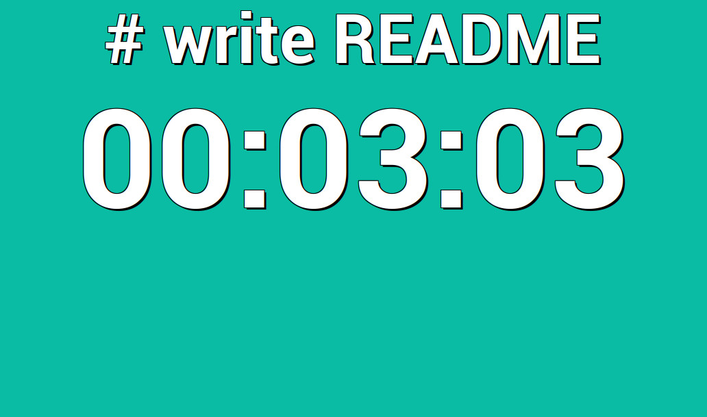
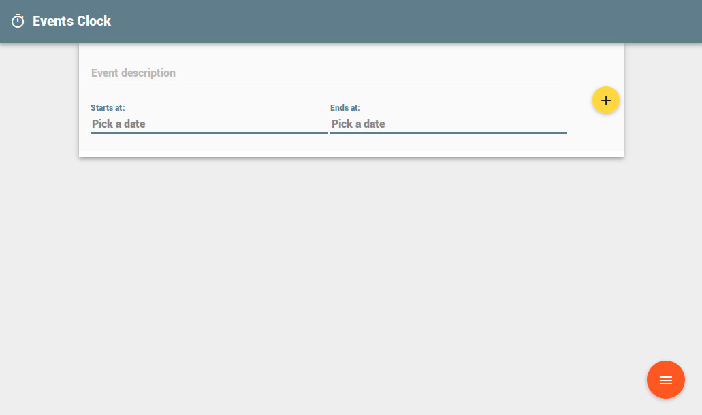
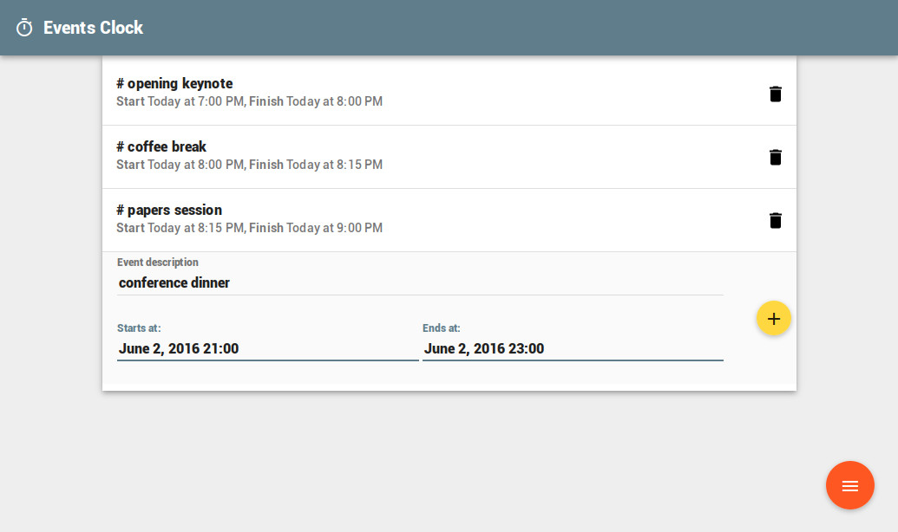
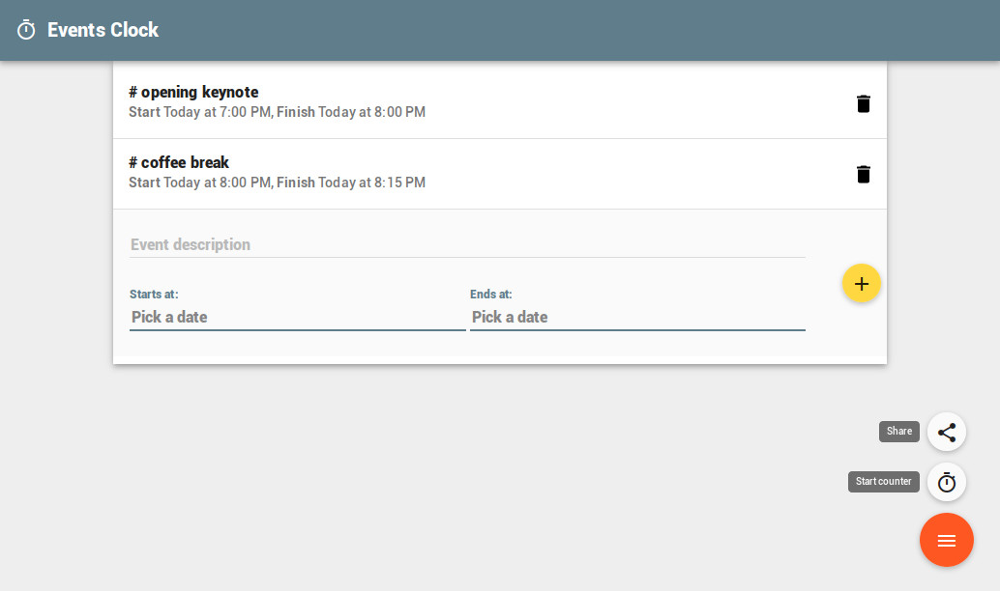
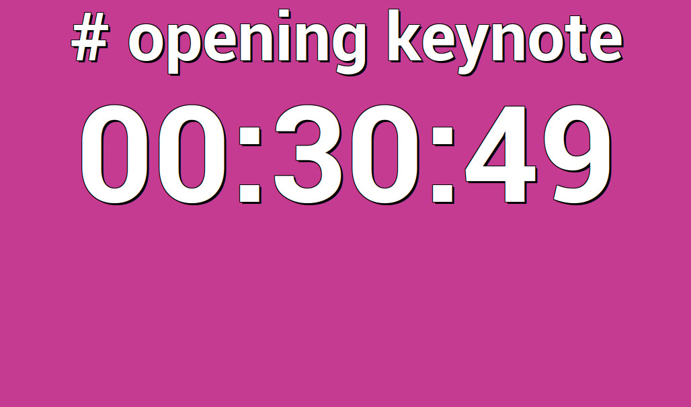

# Events Clock

Events Clock is a simple web application that displays a set of
countdown timers. It was made to be used in public displays at events
like hackathons or conferences.

## Build instructions

Events Clock is a client-side web application built using HTML5 and
AngularJS.

At a minimum, to install dependencies and build the code you will need
to have [Node.js installed](https://nodejs.org/en/download/).

To control the build process you will need to install Gulp and Bower:

    npm install --global gulp-cli
    npm install --global bower

To install additional tool dependencies, run:

    npm install

To install the project library dependencies, run:

    bower install

Then to build the project, do:

    gulp build

And to test:

    gulp serve

and open http://localhost:8000 on your browser

## Usage instructions

When you first start Events Clock you will be taken to the events screen:

The form on this screen allows you to build a list of timer events by filling out the description, start date/time and end date/time of each of them and then pressing the yello add button (marked with a + sign):

From this screen you can also remove specific timer events from the list by clicking the small trash can icon next to each of them.

You can start running your timer events by clicking the "start counter" button that appears when you click the red menu button on the bottom right corner of the screen:

From this menu you can also get a URL that allows anyone to follow your running timer remotely. When you start the timer you should see something like this:

From this running timer screen you can return to the events screen by double clicking the event description text at the top.

