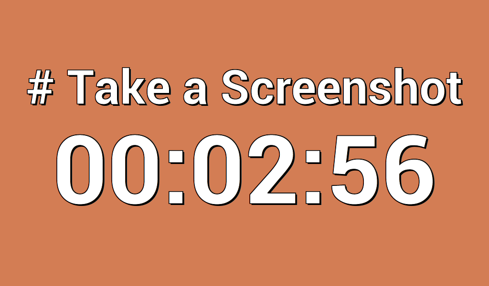

# Events Clock

Events Clock is a simple web application that displays a set of
countdown timers. It was made to be used in public displays at events
like hackathons or conferences.

## Usage instructions

Events Clock is a client-side web application built using HTML5 and
AngularJS.

At a minimum, to install dependencies and build the code you will need
to have [Node.js installed](https://nodejs.org/en/download/).

To control the build process you will need to install Gulp and Bower:

    npm install --global gulp-cli
    npm install --global bower

To install additional tool dependencies, run:

    npm install

To install the project library dependencies, run:

    bower install

Then to build the project, do:

    gulp build

And to test:

    gulp serve

and open http://localhost:8000 on your browser
